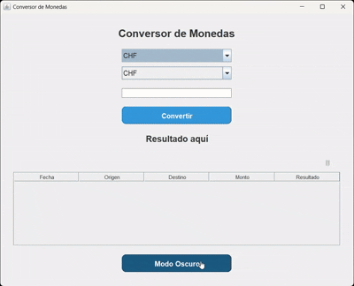

# Conversor de Monedas 💰

Este es un **Conversor de Monedas** desarrollado en Java para el curso de Backend de Alura Latam, que permite convertir entre diferentes divisas utilizando datos en tiempo real desde la API de *ExchangeRate-API*. También cuenta con una **interfaz gráfica** en Swing para facilitar su uso.

## 📌 Características
- Conversión entre múltiples monedas: **USD, ARS, BOB, BRL, CLP, COP, EUR, GBP, JPY, CNY, CHF, CAD, AUD, MXN, INR**.
- Interfaz gráfica intuitiva con **Java Swing**.
- Historial de conversiones con registro de fecha y hora.
- Opción de borrar el historial de conversiones.
- Opción de cambiar a modo oscuro.
- Uso de **API externa** para obtener tasas de conversión actualizadas.
- Diseño limpio y responsivo.

## 🚀 Instalación y Uso
1. **Clonar el repositorio:**
   ```bash
   git clone https://github.com/LucianaC9/conversor-monedas.git

## Vista previa de la aplicación

